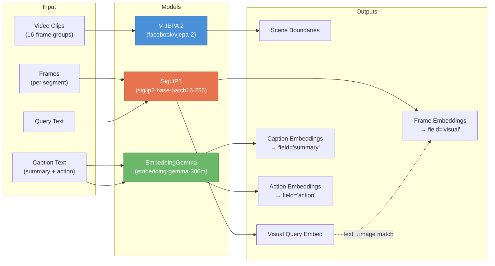
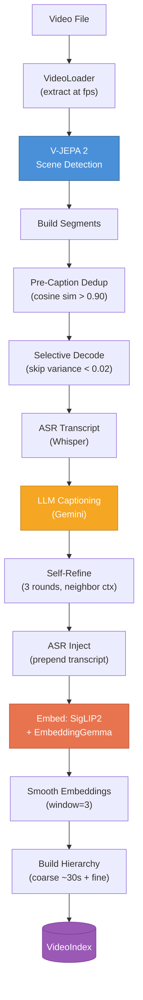
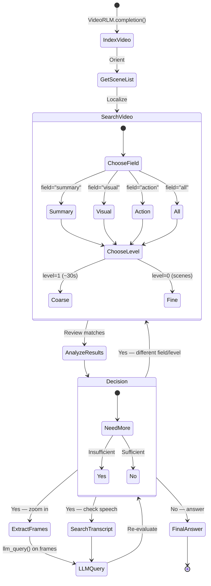
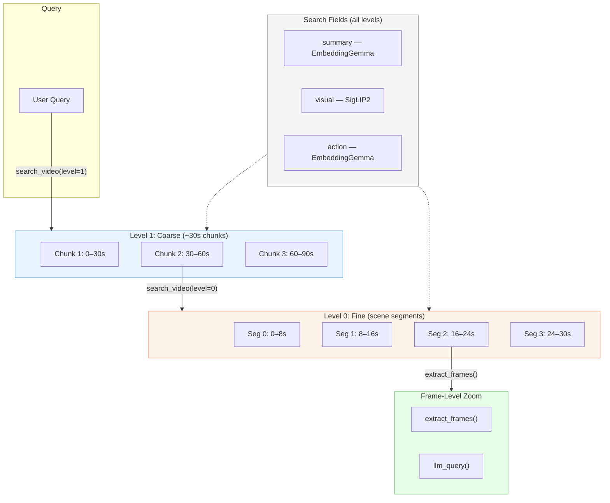

# VideoRLM: Long-Form Video Understanding

**Agentic video analysis that indexes, searches, and reasons over arbitrarily long videos.**

## Overview

VideoRLM builds a searchable multi-scale index from any video — segmenting by scene, captioning with a VLM, embedding across dual spaces, and injecting ASR transcripts — then hands an LLM agent a toolkit to iteratively search, zoom, and reason until it can answer the question.

Unlike systems that sample random frames or cram everything into one context window, VideoRLM uses three specialized models (V-JEPA 2 for temporal scene detection, SigLIP2 for visual embeddings, EmbeddingGemma for semantic embeddings) and a recursive tool-use loop that lets the agent decide what to look at, at what granularity, and through which modality.

Videos of any length are supported. Long videos are automatically segmented via V-JEPA 2 scene boundaries and can optionally be sharded across parallel sub-agent calls.

## Architecture



- **V-JEPA 2** encodes 16-frame video clips and clusters temporal embeddings (Ward linkage) to find scene boundaries based on motion and dynamics, not just visual similarity.
- **SigLIP2** maps frames and text queries into a shared vision-language space for direct visual search (`field="visual"`).
- **EmbeddingGemma** encodes LLM-generated captions into a separate semantic space for `field="summary"` and `field="action"` search.

## Indexing Pipeline



1. **Frame extraction** — Decode frames at configurable FPS (or auto-compute to hit `target_frames`).
2. **V-JEPA 2 scene detection** — Encode 16-frame clips, cluster with Ward linkage to find temporally coherent boundaries.
3. **Pre-caption dedup** — Segments with cosine similarity > 0.90 share captions instead of redundant VLM calls.
4. **Selective decode** — Skip segments with visual variance < 0.02 (~70% of static content).
5. **ASR transcription** — Run Whisper (or load pre-existing transcript) to capture spoken words.
6. **LLM captioning** — Gemini generates structured captions (summary + actions) for non-trivial segments.
7. **Self-Refine** — 3 rounds of neighbor-aware caption refinement for cross-segment coherence.
8. **ASR injection** — Prepend transcript text to captions, making spoken words searchable.
9. **Dual embedding** — Frames via SigLIP2 (visual space), captions via EmbeddingGemma (semantic space), kept separate.
10. **Hierarchy construction** — Fine segments grouped into ~30s coarse chunks with merged captions and averaged embeddings.

## Agentic Search Loop



The agent autonomously loops through: orient (scene list) → coarse search (localize) → fine search (pinpoint) → frame extraction (inspect) → LLM query (reason). Each iteration narrows scope until sufficient evidence is gathered. The agent chooses which modality (visual, semantic, transcript) and granularity (coarse vs fine) to use at each step.

## Available Tools

### Search Tools

**`get_scene_list()`**

| Parameter | Type | Default | Description |
|---|---|---|---|
| *(none)* | — | — | Takes no parameters |

**Returns:** `list[{scene_index, start_time, end_time, caption, annotation}]`

First call to make — provides a complete overview of all detected scenes.

---

**`search_video(query, top_k=5, field="summary", level=0, diverse=True, cluster_diverse=False, exclude_non_action=True)`**

| Parameter | Type | Default | Description |
|---|---|---|---|
| `query` | `str` | *(required)* | Natural-language description of what to find |
| `top_k` | `int` | `5` | Number of results to return |
| `field` | `str` | `"summary"` | Embedding field to search (see table below) |
| `level` | `int` | `0` | Hierarchy level (`0`=fine scenes, `1`+=coarse ~30s chunks) |
| `diverse` | `bool` | `True` | MMR reranking (λ=0.7, 3× candidate pool) |
| `cluster_diverse` | `bool` | `False` | KMeans clustering alternative to MMR — round-robin from clusters |
| `exclude_non_action` | `bool` | `True` | Filter static segments when `field="action"` |

**Returns:** `list[{start_time, end_time, score, caption, annotation}]`

**Field options:**

| Field | Embedding | Model | Best For |
|---|---|---|---|
| `"summary"` | Caption embeddings | EmbeddingGemma | Semantic concepts ("cooking scene", "explanation of recursion") |
| `"action"` | Action embeddings | EmbeddingGemma | Activities ("stir sauce", "write on whiteboard") |
| `"visual"` | Frame embeddings | SigLIP2 | Visual appearance, bypasses caption quality |
| `"all"` | Summary + Action | EmbeddingGemma | Broad search, max score per segment |

**Level options:**

| Level | Granularity | Description |
|---|---|---|
| `0` | Fine — scene segments | Individual V-JEPA 2 scene boundaries |
| `1+` | Coarse — ~30s chunks | Merged segments with aggregated captions and averaged embeddings |

**Diversity options:**

| Option | Method | Description |
|---|---|---|
| `diverse=True` | MMR | Max-Marginal Relevance (λ=0.7) from 3× candidate pool |
| `cluster_diverse=True` | KMeans | Cluster embeddings, round-robin pick from each cluster |

---

**`search_transcript(query)`**

| Parameter | Type | Default | Description |
|---|---|---|---|
| `query` | `str` | *(required)* | Keyword or phrase (case-insensitive) |

**Returns:** `list[{start_time, end_time, text, context}]` — matching lines with ±1 surrounding entries as context.

---

**`get_transcript(start_time, end_time)`**

| Parameter | Type | Default | Description |
|---|---|---|---|
| `start_time` | `float` | *(required)* | Range start in seconds |
| `end_time` | `float` | *(required)* | Range end in seconds |

**Returns:** Timestamped transcript lines as a string.

---

**`discriminative_vqa(question, candidates, time_range=None)`**

| Parameter | Type | Default | Description |
|---|---|---|---|
| `question` | `str` | *(required)* | The question to answer |
| `candidates` | `list[str]` | *(required)* | Multiple-choice answer options |
| `time_range` | `tuple[float, float]` | `None` | Optional (start, end) seconds filter |

Embedding-based multiple-choice VQA without LLM generation. Encodes each `"question candidate"` pair, computes max cosine similarity against segment embeddings.

**Returns:** `list[{answer, confidence, best_segment}]` ranked by confidence.

### Inspection Tools

**`extract_frames(start_time, end_time, fps=2.0, resize=(720, 540), max_frames=10)`**

| Parameter | Type | Default | Description |
|---|---|---|---|
| `start_time` | `float` | *(required)* | Range start in seconds |
| `end_time` | `float` | *(required)* | Range end in seconds |
| `fps` | `float` | `2.0` | Extraction rate within range |
| `resize` | `tuple[int,int]` | `(720, 540)` | Output frame dimensions |
| `max_frames` | `int` | `10` | Maximum frames to return |

**Returns:** `list[image_dict]` — tagged image dicts for `llm_query`.

---

**`llm_query(prompt, images)`**

Send extracted frames to a sub-LLM for detailed visual question answering. The core "zoom and reason" tool.

---

**`llm_query_batched(prompts)`**

Parallel batch of LLM queries for multi-segment analysis.

### Pixel Tools

| Tool | Parameters | Description |
|---|---|---|
| **`threshold_frame()`** | `image_dict`, `value=128` | Binary threshold — pixels above value → white, below → black. Text/edge detection. |
| **`crop_frame()`** | `image_dict`, `x1_pct`, `y1_pct`, `x2_pct`, `y2_pct` | ROI extraction with percentage coordinates (0.0–1.0). |
| **`diff_frames()`** | `image_dict_a`, `image_dict_b` | Absolute pixel difference between two frames. Bright areas = change. Motion detection. |
| **`blend_frames()`** | `image_dicts` | Average frames into composite. Motion summary or static element detection. |
| **`frame_info()`** | `image_dict` | Returns `{width, height, mean_brightness, std_brightness, min_brightness, max_brightness}`. |

### Core REPL Tools

These are always available in the RLM REPL environment — they form the foundation of the recursive reasoning loop.

| Tool | Signature | Description |
|---|---|---|
| **`context`** | `dict` (variable) | Video data dictionary with `context["type"]`, `context["metadata"]` (duration, fps, resolution), `context["segments"]` (list of segment dicts with `frames`, `start_time`, `end_time`), or `context["frames"]` (flat frame list). |
| **`llm_query()`** | `prompt: str \| list` → `str` | Query a sub-LLM. Pass a string for text-only, or a list of strings + image dicts for multimodal. Single LM completion — no tool access. |
| **`llm_query_batched()`** | `prompts: list[str \| list]` → `list[str]` | Concurrent sub-LLM queries. Each prompt can be text or multimodal. Use for parallel multi-segment analysis. |
| **`SHOW_VARS()`** | — | List all variables currently in the REPL namespace. |
| **`print()`** | `*args` | Inspect intermediate results. Output is captured and fed back to the agent. |
| **`FINAL(answer)`** | `str` | Submit the final answer directly (no REPL block needed). |
| **`FINAL_VAR(name)`** | `str` | Submit a previously assigned variable as the final answer. Variable must exist in the REPL namespace first. |

### Sharding Tools

Available when `enable_sharding=True` for long videos divided across parallel sub-agent calls.

| Tool | Signature | Description |
|---|---|---|
| **`get_shard_info()`** | — → `list[str]` | Get a description of each video shard's segment range and timestamps. |
| **`shard_prompts`** | `list[list]` (variable) | Pre-built multimodal prompts for each shard. Pass to `llm_query_batched(shard_prompts)` to analyze all shards in parallel, then aggregate results. |

**Sharding example:**
```python
# Analyze all shards in parallel
shard_results = llm_query_batched(shard_prompts)
for i, result in enumerate(shard_results):
    print(f"Shard {i+1}: {result[:200]}")
```

## Multi-Scale Search



The agent starts broad (coarse level=1, ~30s chunks) to localize relevant regions, narrows to fine level=0 (individual scene segments) for precision, then zooms to frame-level with `extract_frames()` + `llm_query()`. All three search fields (`summary`, `visual`, `action`) are available at every level.

## Key Optimizations

- **V-JEPA 2 temporal scene detection** — Ward linkage clustering on video clip embeddings for motion-aware boundaries.
- **Selective decoding** — Skip ~70% of uniform segments (visual variance < 0.02) during captioning.
- **Pre-caption dedup** — Segments with cosine similarity > 0.90 share captions, avoiding redundant VLM calls.
- **Self-Refine** — 3 rounds of neighbor-aware caption refinement for coherence and reduced hallucination.
- **ASR transcript injection** — Whisper transcripts prepended to captions, making spoken words searchable.
- **Dual embedding spaces** — Visual (SigLIP2) and semantic (EmbeddingGemma) kept separate to avoid cross-modal contamination.
- **Embedding smoothing** — Moving average (window=3) enforces temporal coherence across adjacent segments.

## Quick Start

```python
from rlm.logger import RLMLogger
from rlm.video import VideoRLM

logger = RLMLogger(log_dir="./logs")

vrlm = VideoRLM(
    backend="gemini",
    backend_kwargs={"model_name": "gemini-3-flash-preview", "timeout": 300.0},
    fps=0.5,
    num_segments=5,
    max_frames_per_segment=3,
    resize=(640, 480),
    max_iterations=15,
    logger=logger,
    verbose=True,
    enable_search=True,
    scene_model="facebook/vjepa2-vitl-fpc64-256",
    text_embedding_model="google/embeddinggemma-300m",
)

result = vrlm.completion(
    "path/to/video.mp4",
    prompt="Provide a comprehensive analysis of this video.",
)

print(result.response)
```

## Configuration

| Parameter | Type | Default | Description |
|---|---|---|---|
| `backend` | `str` | `"openai"` | LLM backend (`"openai"`, `"anthropic"`, `"gemini"`) |
| `fps` | `float` | `1.0` | Frame extraction rate (frames/second) |
| `num_segments` | `int \| None` | `None` | Number of temporal segments (`None` = no segmentation) |
| `max_frames_per_segment` | `int \| None` | `None` | Cap frames per segment in LLM context |
| `resize` | `tuple[int,int] \| None` | `None` | Resize frames to (width, height) |
| `max_iterations` | `int` | `30` | Maximum REPL iterations per completion |
| `token_budget` | `int \| None` | `None` | Max tokens before wrap-up signal |
| `enable_search` | `bool` | `True` | Build search index and expose search tools |
| `scene_model` | `str \| None` | `None` | V-JEPA 2 model (e.g. `"facebook/vjepa2-vitl-fpc64-256"`) |
| `text_embedding_model` | `str \| None` | `None` | Text encoder (e.g. `"google/embeddinggemma-300m"`) |
| `embedding_model` | `str` | `"google/siglip2-base-patch16-256"` | SigLIP2 model for frame embeddings |
| `auto_fps` | `bool` | `False` | Auto-compute FPS from video duration |
| `target_frames` | `int` | `120` | Target frame count when `auto_fps=True` |
| `enable_sharding` | `bool` | `False` | Shard long videos across parallel sub-agents |
| `shard_max_segments` | `int` | `5` | Max segments per shard |
| `whisper_model` | `str` | `"base"` | Whisper model size for ASR |
